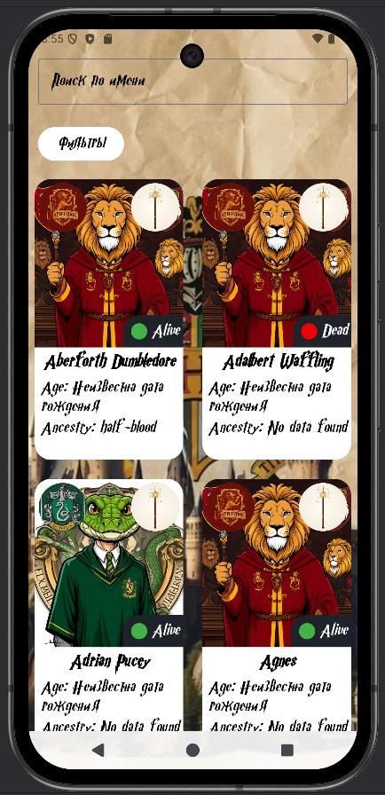
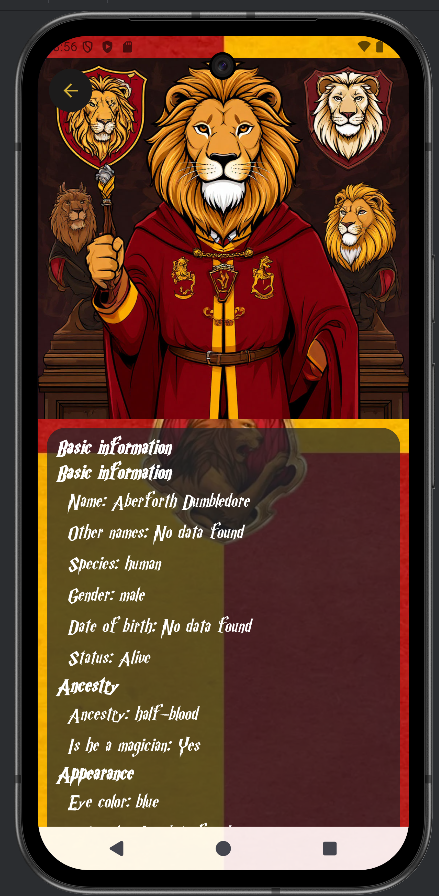
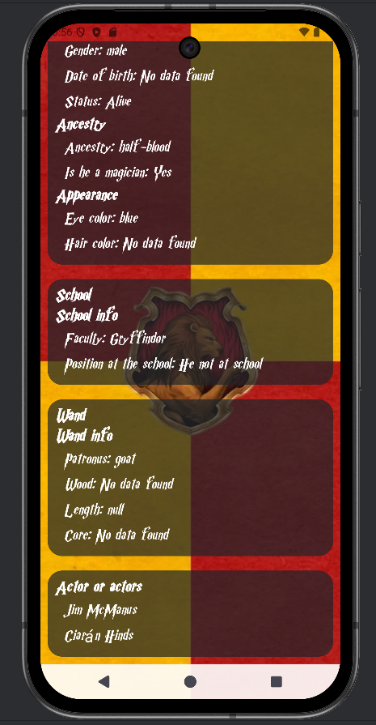

[README_Hogwarts.md](https://github.com/user-attachments/files/27236549/README_Hogwarts.md)
<div align="center">

# ⚡ Hogwarts Characters

### Энциклопедия персонажей вселенной Гарри Поттера

*Мобильное приложение с полными профилями, факультетской системой*  
*и многоуровневой фильтрацией всех персонажей Хогвартса.*

<br>


</div>

---

## 📱 Скриншоты

<div align="center">

| Главный экран | Информация о персонаже |
|:---:|:---:|
|  |    |

</div>

---

## ✨ Возможности

| Модуль | Описание |
|--------|----------|
| 👥 **Профили персонажей** | Фото, дата рождения, факультет, патронус, волшебная палочка, происхождение |
| 🏠 **Факультетская система** | Все 4 факультета с тематическим дизайном и уникальными иконками |
| 🔍 **Поиск и фильтрация** | По имени, факультету, должности, способностям и происхождению |
| 📄 **Два формата просмотра** | Сетка с карточками и детальный профиль с полной информацией |
| 🎨 **Адаптивный UI** | Ленивая загрузка, пагинация, цветовые индикаторы статусов |
| ⚡ **Офлайн-режим** | Двухуровневое кэширование — данные доступны без интернета |

---

## 🏗 Архитектура

Проект построен на **Clean Architecture** с модульной структурой. Каждый модуль независим и компилируется отдельно — это ускоряет сборку и упрощает масштабирование.

```
HogwartsCharacters/
├── app/                          # Entry point, DI, навигация
│
├── core/
│   ├── core-data/                # Retrofit, Room, Repository impl
│   │   ├── remote/               # API-клиент, модели, RemoteDataSource
│   │   └── local/                # DAO, БД, LocalDataSource, SaveImageHelper
│   ├── core-domain/              # Модели, интерфейсы репозиториев, Use Cases
│   ├── core-navigation/          # NavRoutes — единые маршруты
│   ├── core-ui/                  # Shared-компоненты, тема Material 3
│   └── core-util/                # Вспомогательные утилиты
│
└── feature/
    ├── feature-main/             # Главный экран: сетка персонажей, поиск, фильтры
    └── feature-character-detail/ # Детальный профиль персонажа
```

### Ключевые архитектурные решения

- **Single Activity** — вся навигация через Jetpack Compose Navigation, единый lifecycle
- **MVVM + StateFlow** — реактивное управление состоянием UI
- **Repository Pattern** — `RemoteDataSource` и `LocalDataSource` за единым интерфейсом
- **Use Cases** — `GetCharactersUseCase`, `GetCharacterByIdUseCase` инкапсулируют бизнес-логику

---

## 🛠 Технологический стек

| Категория | Технология |
|-----------|------------|
| **Язык** | Kotlin 1.9+ |
| **UI** | Jetpack Compose, Material Design 3 |
| **Навигация** | Jetpack Compose Navigation |
| **Сеть** | Retrofit + REST API |
| **База данных** | Room (TypeConverters, миграции) |
| **Изображения** | Coil (мемоизация, кэш на диске) |
| **DI** | Koin |
| **Асинхронность** | Coroutines, StateFlow |

---

## ⚙️ Особенности реализации

- **Двухуровневое кэширование** — сначала память, затем диск; сеть только при необходимости
- **Оптимизация изображений** — `SaveImageHelper` проверяет дубликаты перед сохранением
- **Фоновая синхронизация** — пакетное сохранение данных без блокировки UI
- **Полная обработка ошибок** — явные UI-состояния `Loading / Success / Error`
- **Type Converters** — сложные типы (волшебные палочки, списки) корректно хранятся в Room

---

## 🚀 Установка и запуск

### Требования

- Android Studio Hedgehog или новее
- Android SDK 34+
- Kotlin 1.9+
- Gradle 8.0+

### Шаги

```bash
# 1. Клонировать репозиторий
git clone https://github.com/your-username/HogwartsCharacters.git

# 2. Открыть в Android Studio
# File → Open → выбрать папку HogwartsCharacters

# 3. Дождаться синхронизации Gradle и запустить
# Run → Run 'app'  (Shift + F10)
```

Приложение загружает данные из публичного API при первом запуске и кэширует их локально.

---

## 📬 Контакты

Нашли баг или есть предложение? Создайте **Issue** в репозитории или напишите напрямую:

**vladislav.yurshin.work@yandex.ru**
